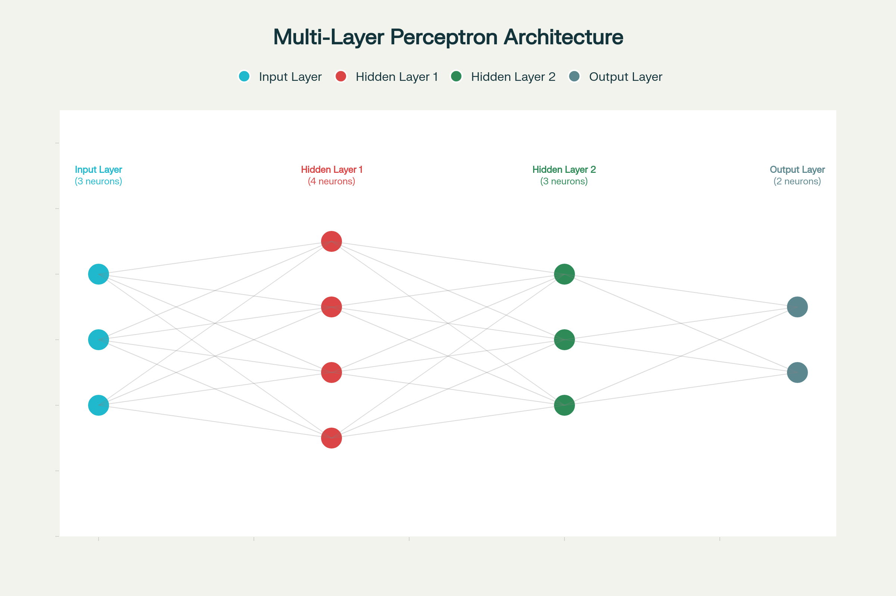
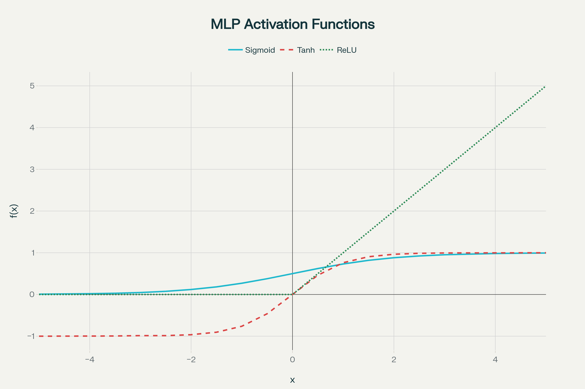

# Veille theorique <!-- omit in toc -->

# Sommaire <!-- omit in toc -->
- [🚀 Perceptron Multicouches (MLP) : Architecture et Avancées Récentes](#-perceptron-multicouches-mlp--architecture-et-avancées-récentes)
  - [🔧 Architecture Fondamentale du MLP](#-architecture-fondamentale-du-mlp)
    - [Couche d'Entrée (Input Layer)](#couche-dentrée-input-layer)
    - [Couches Cachées (Hidden Layers)](#couches-cachées-hidden-layers)
    - [Couche de Sortie (Output Layer)](#couche-de-sortie-output-layer)
  - [⚡️ Fonctions d’Activation Essentielles](#️-fonctions-dactivation-essentielles)
    - [Fonction Sigmoid](#fonction-sigmoid)
    - [Fonction Tanh](#fonction-tanh)
    - [Fonction ReLU](#fonction-relu)
  - [📚 Théorème d’Approximation Universelle](#-théorème-dapproximation-universelle)
  - [🔄 Algorithme de Rétropropagation](#-algorithme-de-rétropropagation)
    - [Phase Forward (Propagation Avant)](#phase-forward-propagation-avant)
    - [Phase Backward (Rétropropagation)](#phase-backward-rétropropagation)
  - [🛡️ Techniques de Régularisation Modernes](#️-techniques-de-régularisation-modernes)
    - [Dropout](#dropout)
    - [Autres Techniques de Régularisation](#autres-techniques-de-régularisation)
  - [🌐 Applications Contemporaines \& Tendances 2025](#-applications-contemporaines--tendances-2025)
    - [Domaines d'Excellence des MLP](#domaines-dexcellence-des-mlp)
    - [MLP vs Architectures Modernes](#mlp-vs-architectures-modernes)
  - [🔬 Avancées Récentes](#-avancées-récentes)
    - [Optimisations Architecturales](#optimisations-architecturales)
    - [Applications Émergentes](#applications-émergentes)
    - [Défis et Limitations Actuels](#défis-et-limitations-actuels)
- [🎯 Choix d’Architecture selon la Problématique](#-choix-darchitecture-selon-la-problématique)
  - [1. Couche de Sortie et Fonction d’Activation](#1-couche-de-sortie-et-fonction-dactivation)
  - [2. Couches Cachées et Fonctions d’Activation](#2-couches-cachées-et-fonctions-dactivation)
  - [3. Choix de la Fonction de Perte et Optimisation](#3-choix-de-la-fonction-de-perte-et-optimisation)
  - [4. Illustration Comparée](#4-illustration-comparée)
  - [5. Conclusion](#5-conclusion)
- [Définitions des Termes Clés en Réseaux de Neurones](#définitions-des-termes-clés-en-réseaux-de-neurones)
  - [Fonction d’activation](#fonction-dactivation)
  - [Propagation (Forward Propagation)](#propagation-forward-propagation)
  - [Rétropropagation (Backpropagation)](#rétropropagation-backpropagation)
  - [Loss-function (Fonction de perte)](#loss-function-fonction-de-perte)
  - [Descente de gradient (Gradient Descent)](#descente-de-gradient-gradient-descent)
  - [Vanishing Gradients](#vanishing-gradients)
- [Hyperparamètres d’un Réseau de Neurones et Bonnes Pratiques](#hyperparamètres-dun-réseau-de-neurones-et-bonnes-pratiques)
  - [⚙️ Hyperparamètres et Bonnes Pratiques](#️-hyperparamètres-et-bonnes-pratiques)

# 🚀 Perceptron Multicouches (MLP) : Architecture et Avancées Récentes

Le **Perceptron Multicouches** (MLP - Multi-Layer Perceptron) constitue l'une des architectures fondamentales de l'apprentissage profond, offrant une capacité remarquable d'approximation universelle de fonctions continues. Cette veille technologique examine son architecture, ses composants clés et les développements récents dans le domaine.

---

## 🔧 Architecture Fondamentale du MLP

   

Architecture d'un Perceptron Multicouches (MLP) montrant les couches d'entrée, cachées et de sortie avec connexions complètes
Un MLP est un réseau de neurones feedforward composé d'au moins trois types de couches organisées séquentiellement :

### Couche d'Entrée (Input Layer)

La couche d'entrée reçoit les données brutes et les transmet aux couches suivantes sans transformation. Chaque neurone de cette couche correspond à une caractéristique d'entrée du jeu de données. Par exemple, pour un problème avec trois variables d'entrée, la couche d'entrée comportera trois neurones.

### Couches Cachées (Hidden Layers)

Les couches cachées constituent le cœur computationnel du MLP. Chaque neurone d'une couche cachée :

- Reçoit des entrées pondérées de tous les neurones de la couche précédente
- Calcule une somme pondérée des entrées avec addition d'un biais
- Applique une fonction d'activation non-linéaire pour introduire la non-linéarité
- Transmet le résultat à la couche suivante

Le nombre de couches cachées et de neurones par couche détermine la complexité et la capacité d'approximation du modèle.

### Couche de Sortie (Output Layer)
La couche de sortie génère les prédictions finales. Pour la classification binaire, elle contient généralement un neurone avec activation sigmoid. Pour la classification multi-classes, elle comprend autant de neurones que de classes avec activation softmax.

---

## ⚡️ Fonctions d’Activation Essentielles

   

Comparaison des fonctions d'activation principales utilisées dans les MLP : Sigmoid, Tanh et ReLU  

Les fonctions d'activation introduisent la non-linéarité nécessaire pour que le MLP puisse approximer des fonctions complexes :

### Fonction Sigmoid
La fonction **sigmoid** σ(x) = 1/(1+e^(-x)) :
- Plage de sortie : (0, 1)
- Avantages : Interprétation probabiliste pour la classification binaire
- Inconvénients : Problème de **gradient évanescent** pour les réseaux profonds

### Fonction Tanh
La fonction **tanh** tanh(x) :
- Plage de sortie : (-1, 1)
- Avantages : **Centrée sur zéro**, améliore la convergence
- Inconvénients : Gradient évanescent similaire à sigmoid

### Fonction ReLU
La **ReLU** (Rectified Linear Unit) f(x) = max(0, x) :
- Plage de sortie : (0, ∞)
- Avantages : **Calcul rapide**, évite le gradient évanescent
- Inconvénients : Problème du "neurone mort" (dying ReLU)
- **Usage recommandé** : Fonction par défaut pour les couches cachées des MLP modernes

---

## 📚 Théorème d’Approximation Universelle

Le **Théorème d'Approximation Universelle** constitue le fondement théorique de la puissance des MLP. Il stipule qu'un MLP avec :
- **Une seule couche cachée**
- Un **nombre suffisant de neurones**
- Des **fonctions d'activation non-polynomiales**

peut approximer **toute fonction continue** sur un ensemble compact avec une précision arbitraire.

Cette propriété fondamentale explique pourquoi les MLP sont des **approximateurs universels de fonctions**, bien que le théorème ne précise ni le nombre de neurones nécessaires ni la méthode pour trouver les poids optimaux.

---

## 🔄 Algorithme de Rétropropagation

L'**algorithme de rétropropagation** (backpropagation) reste la méthode standard d'entraînement des MLP :

### Phase Forward (Propagation Avant)
- Les données traversent le réseau de l'entrée vers la sortie
- Chaque couche calcule ses sorties basées sur les entrées pondérées
- Application des fonctions d'activation

### Phase Backward (Rétropropagation)
- Calcul de l'erreur entre prédiction et valeur réelle
- **Propagation inverse** de l'erreur en utilisant la **règle de la chaîne**
- Mise à jour des poids et biais par **descente de gradient**

Cette approche permet l'optimisation itérative des paramètres du réseau pour minimiser la fonction de perte.

---

## 🛡️ Techniques de Régularisation Modernes

### Dropout

Le **dropout** constitue une technique de régularisation majeure pour lutter contre le surapprentissage :

- **Désactivation aléatoire** de neurones pendant l'entraînement
- Taux typiques : 20-50% selon les couches
- Avantages : Prévention du surapprentissage, amélioration de la généralisation
- Implémentation : Facilement intégrable dans les frameworks modernes

### Autres Techniques de Régularisation

- **Régularisation L1/L2** des poids
- **Early stopping** basé sur la validation
- **Batch normalization** pour stabiliser l'entraînement

---

## 🌐 Applications Contemporaines & Tendances 2025

### Domaines d'Excellence des MLP
Les MLP modernes excellent particulièrement dans :

**Données Tabulaires Structurées** :
- Scoring de crédit et détection de fraude
- Analyse de données médicales
- Prédiction de performance industrielle

**Traitement Multimodal** :
- Combinaison vision-langage pour la robotique
- Systèmes de modération de contenu
- Applications de réalité augmentée

### MLP vs Architectures Modernes
Contrairement aux **Transformers** qui dominent le NLP et la vision à grande échelle, les MLP restent compétitifs pour :
- **Datasets de taille petite à moyenne**
- **Applications temps réel** nécessitant une inférence rapide
- **Environnements avec ressources limitées**
- **Tâches nécessitant une interprétabilité élevée**

---

## 🔬 Avancées Récentes

### Optimisations Architecturales
Recherches récentes sur :
- **MLP hybrides** combinés avec des couches convolutionnelles
- **Réseaux résiduels** pour MLP profonds permettant d'éviter le gradient évanescent
- **Techniques d'apprentissage auto-supervisé** pour MLP

### Applications Émergentes
Nouveaux domaines d'application :
- **Sciences des matériaux** : Prédiction de propriétés avec des MLP de 17 couches
- **Médecine prédictive** : Diagnostic automatisé par analyse multimodale
- **Robotique intelligente** : Intégration MLP dans les systèmes de navigation

### Défis et Limitations Actuels

**Limitations Théoriques** :
- Le théorème d'approximation ne garantit pas la **généralisation**
- Pas d'indication sur la **taille optimale** du réseau
- Risque de **surapprentissage** avec des réseaux trop complexes

**Défis Pratiques** :
- **Paramétrage difficile** du nombre de couches et neurones
- **Convergence vers des minima locaux**
- **Manque d'interprétabilité** des représentations internes

# 🎯 Choix d’Architecture selon la Problématique

Lors de la conception d’un **Perceptron Multicouches (PMC)**, l’architecture (nombre de neurones, fonctions d’activation, couches, etc.) doit être adaptée au type de tâche : **classification** ou **régression**.

## 1. Couche de Sortie et Fonction d’Activation

- **Régression**  
  - **Nombre de neurones** : 1 (ou plusieurs pour multi-sorties)  
  - **Activation** : *linéaire* (\(\mathrm{identity}\)) → permet de prédire une valeur continue [124]  
  - **Fonction de perte** : *Mean Squared Error* (MSE)  
    \[
      \mathrm{MSE} = \frac{1}{N}\sum_{i=1}^N (y_i - \hat y_i)^2
    \]  
    adaptée si l’erreur suit une distribution gaussienne

- **Classification binaire**  
  - **Nombre de neurones** : 1  
  - **Activation** : *sigmoid*  
    \[
      \sigma(x)=\frac{1}{1+e^{-x}}
    \]  
  - **Fonction de perte** : *Binary Cross-Entropy*  
    \[
      L = -\frac{1}{N}\sum_{i=1}^N \bigl[y_i\log(\hat y_i)+(1-y_i)\log(1-\hat y_i)\bigr]
    \]  
    correspond au maximum de vraisemblance sous distribution binomiale

- **Classification multi-classes**  
  - **Nombre de neurones** : \(K\) (nombre de classes)  
  - **Activation** : *softmax*  
    \[
      \mathrm{softmax}(z)_j = \frac{e^{z_j}}{\sum_{k=1}^K e^{z_k}}
    \]  
  - **Fonction de perte** : *Categorical Cross-Entropy*  
    \[
      L = -\frac{1}{N}\sum_{i=1}^N \sum_{j=1}^K y_{ij}\log(\hat y_{ij})
    \]  
    adaptée au maximum de vraisemblance sous distribution multinomiale

## 2. Couches Cachées et Fonctions d’Activation

- **Objectif** : extraire des représentations non-linéaires  
- **Fonctions usuelles** :  
  - *ReLU* (\(\max(0,x)\)) pour éviter le gradient évanescent et accélérer l’entraînement
  - *tanh* ou *sigmoid* peuvent être utilisées si la centration sur zéro est souhaitée, malgré le risque de saturation

- **Nombre de couches / neurones**  
  - Dépend de la **complexité du problème**  
  - Règles empiriques :  
    1. Commencer par 1–2 couches cachées et ajuster selon la performance  
    2. Taille de chaque couche entre la taille d’entrée et de sortie 
    3. Utiliser la validation croisée et le **dropout** pour éviter le sur-apprentissage

## 3. Choix de la Fonction de Perte et Optimisation

- **Régression** → MSE, descente de gradient classique  
- **Classification** → Cross-Entropy (binaire ou catégorielle), optimisation via Adam, SGD, etc.  
- **Regularisation** :  
  - *L2* (poids)  
  - *Dropout* (20–50%) pour améliorer la généralisation

## 4. Illustration Comparée

| Problème          | Sortie                    | Activation sortie | Neurones sortie | Perte             |
|-------------------|---------------------------|-------------------|-----------------|-------------------|
| Régression        | Valeur continue           | Linéaire          | 1               | MSE               |
| Classification binaire | Probabilité [0,1]       | Sigmoid           | 1               | Binary Cross-Entropy |
| Classification multi-classes | Distribution de classes | Softmax           | \(K\)           | Categorical Cross-Entropy |

**Bonnes pratiques :**  
- Couches cachées : 1–3 couches, fonctions ReLU  
- Taille : 32–512 neurones  
- Learning rate : 1e−4 à 1e−2, scheduler  
- Batch size : 32–64  
- Dropout : 20–50 % + batch normalization  

## 5. Conclusion

Le **choix d’architecture** d’un PMC doit être guidé par :

1. **Nature de la sortie** (continue vs discrète)  
2. **Fonction d’activation** adaptée  
3. **Fonction de perte** cohérente avec la distribution statistique du problème  
4. **Complexité du modèle** (couches cachées, neurones) mesurée par essais itératifs et régularisation

Ainsi, un PMC bien configuré maximise la qualité de prédiction tout en maîtrisant le sur-apprentissage et la convergence.

# Définitions des Termes Clés en Réseaux de Neurones

## Fonction d’activation  
Une **fonction d’activation** est une transformation non linéaire appliquée à la somme pondérée des entrées d’un neurone plus son biais. Elle permet au réseau d’introduire de la non-linéarité, essentielle pour modéliser des relations complexes.  
- Exemples : *sigmoid*, *tanh*, *ReLU*

---

## Propagation (Forward Propagation)  
La **propagation avant** désigne le processus par lequel les données d’entrée traversent séquentiellement chaque couche du réseau :  
1. Calcul de la somme pondérée et du biais  
2. Application de la fonction d’activation  
3. Transmission du résultat à la couche suivante  
Ce mécanisme produit la prédiction finale du réseau

---

## Rétropropagation (Backpropagation)  
La **rétropropagation** est l’algorithme d’apprentissage qui :  
1. Calcule l’erreur entre prédiction et vérité terrain  
2. Propage cette erreur vers l’arrière à travers chaque couche en utilisant la règle de la chaîne  
3. Met à jour les poids et biais par descente de gradient  
C’est la méthode standard pour entraîner les MLP et autres réseaux profonds

---

## Loss-function (Fonction de perte)  
La **fonction de perte** quantifie l’écart entre les prédictions du modèle et les valeurs réelles. Elle guide l’apprentissage en fournissant un signal d’erreur :  
- *MSE* (Mean Squared Error) pour la régression  
- *Cross-Entropy* pour la classification  
Le choix de la loss-function dépend de la nature du problème et de la distribution statistique sous-jacente

---

## Descente de gradient (Gradient Descent)  
La **descente de gradient** est un algorithme d’optimisation itératif qui ajuste les paramètres (poids et biais) d’un réseau en suivant la direction opposée au gradient de la fonction de perte.  
- Variantes : SGD, Adam, RMSprop  
- Objectif : minimiser la loss-function

---

## Vanishing Gradients  
Le phénomène de **vanishing gradients** survient lorsque les gradients calculés lors de la rétropropagation deviennent extrêmement petits, rendant l’apprentissage des premières couches très lent voire impossible.  
- Principalement dû aux fonctions d’activation qui saturent (sigmoid, tanh)  
- Provoque une convergence difficile pour les réseaux profonds

# Hyperparamètres d’un Réseau de Neurones et Bonnes Pratiques

1. **Taux d’apprentissage (Learning Rate)**  
   - Valeur typique : entre 1e−4 et 1e−2  
   - Bonnes pratiques :  
     - Commencer bas (1e−3) et ajuster avec des méthodes adaptatives (Adam, RMSprop)  
     - Utiliser un scheduler (diminution progressive ou warm-up)  
     - Observer les courbes de perte pour détecter oscillations ou stagnation  

2. **Nombre de couches cachées et taille des couches**  
   - Valeurs typiques : 1 à 4 couches, 32 à 512 neurones par couche  
   - Bonnes pratiques :  
     - Démarrer simple (1–2 couches, 64–128 neurones)  
     - Augmenter progressivement en validant les gains de performance  
     - Éviter les architectures excessivement profondes sans justification (Vanishing gradients)  

3. **Taille du batch (Batch Size)**  
   - Valeurs typiques : 16, 32, 64 ou 128  
   - Bonnes pratiques :  
     - Batch moyen (32–64) pour équilibre biais/variance  
     - Batch plus grand si le GPU dispose de mémoire suffisante  
     - Ajuster selon la stabilité du gradient (batch trop petit = gradient bruyant)  

4. **Fonction d’activation**  
   - Choix courant : ReLU pour les couches cachées  
   - Bonnes pratiques :  
     - Utiliser ReLU ou variantes (Leaky ReLU, GELU) pour éviter le vanishing gradients  
     - Pour les problèmes spécifiques, tester tanh (centré zéro) ou Swish  
     - Ne pas choisir sigmoid/tanh dans les couches internes d’un réseau profond  

5. **Taux de dropout (Dropout Rate)**  
   - Valeurs typiques : 0,2 à 0,5  
   - Bonnes pratiques :  
     - Appliquer dropout uniquement entre couches cachées  
     - Commencer autour de 0,3 et ajuster en fonction du surapprentissage observé  
     - Coupler avec batch normalization pour stabiliser l’entraînement  

6. **Fonction de perte**  
   - Sélection : MSE pour régression, Cross-Entropy pour classification  
   - Bonnes pratiques :  
     - Vérifier la distribution des cibles pour correspondre à l’hypothèse de la loss-function  
     - En classification déséquilibrée, utiliser *weighted* Cross-Entropy ou focal loss  

7. **Optimiseur et paramètres associés**  
   - Choix courant : Adam avec β₁=0,9, β₂=0,999  
   - Bonnes pratiques :  
     - Tester AdamW pour la régularisation L2  
     - Ajuster ε (epsilon) si la perte diverge ou stagne  

---

## ⚙️ Hyperparamètres et Bonnes Pratiques

| Hyperparamètre        | Valeurs typiques   | Astuces                                           |
|:---------------------:|:------------------:|:-------------------------------------------------:|
| Learning rate         | 1e−4 – 1e−2        | Scheduler, warm-up, surveiller la courbe de perte |
| Nombre de couches     | 1 – 4              | Démarrer simple, valider chaque ajout             |
| Neurones par couche   | 32 – 512           | Entre taille d’entrée et de sortie                |
| Batch size            | 16, 32, 64         | Équilibre biais/variance                          |
| Dropout rate          | 0,2 – 0,5          | Ajuster selon overfitting                         |
| Fonction de perte     | MSE / Cross-Entropy| Adapter au type de tâche                          |
| Optimiseur            | Adam (β₁=0,9; β₂=0,999) | Tester AdamW, ajuster ε                       |

> Pour chaque projet, **rechercher** la combinaison optimale d’hyperparamètres (grid/random search, Bayesian optimization) et **monitorer** la validation.